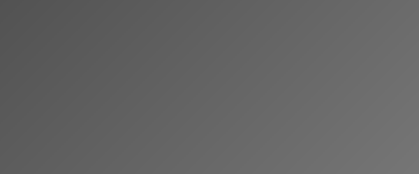

# レスポンシブなカフェサイトを作ろう

Webサイト制作の基本を学びながら、実際にカフェのランディングページを作っていきましょう。
HTML・CSSの基礎から、レスポンシブ対応、Sassの導入まで一通り体験できます。


## HTML構造を組み立てよう

まずはHTMLでページの骨組みを作成します。[important::セマンティックなタグ]を意識して書くことが大切です。

### ヘッダー部分の実装

ヘッダーにはロゴとナビゲーションを配置します。

```html:index.html
<!DOCTYPE html>
<html lang="ja">
<head>
  <meta charset="UTF-8">
  <meta name="viewport" content="width=device-width, initial-scale=1.0">
  <title>Café Sunrise</title>
  <link rel="stylesheet" href="css/style.css">
</head>
<body>
  <header class="header">
    <h1 class="header__logo">Café Sunrise</h1>
    <nav class="header__nav">
      <a href="#menu">メニュー</a>
      <a href="#access">アクセス</a>
      <a href="#contact">お問い合わせ</a>
    </nav>
  </header>
</body>
</html>
```

:::title[HTMLの基本ルール]
- 必ず`<!DOCTYPE html>`を宣言する
- `lang`属性で言語を指定する
- `meta viewport`でレスポンシブ対応の準備をする
:::

#### よく使うセマンティックタグ

:::custom-table
| タグ | 用途 | 備考 |
| --- | --- | --- |
| `header` | ページやセクションのヘッダー | サイト全体に1つ |
| `nav` | ナビゲーション | 主要なリンク群に使用 |
| `main` | メインコンテンツ | ページに1つだけ |
| `section` | テーマ別のセクション | 見出しとセットで使う |
| `footer` | フッター | 著作権やリンク |
| `article` | 独立したコンテンツ | ブログ記事など |
:::

##### 補足：classの命名規則

BEM（Block Element Modifier）を使うと[marker::クラス名が整理されて保守しやすく]なります。

`.block__element--modifier` の形式で命名します。

## CSSでスタイリングしよう

HTMLの骨組みができたら、CSSで見た目を整えていきます。

### リセットCSSの適用

ブラウザごとのデフォルトスタイルの差異をなくすため、最初にリセットCSSを書きます。

```css:css/reset.css
*,
::before,
::after {
  box-sizing: border-box;
}

html, body, h1, h2, h3, h4, h5, h6,
ul, ol, dl, li, dt, dd, p, div, span,
img, a, table, tr, th, td {
  padding: 0;
  margin: 0;
  font-size: 100%;
  font-weight: normal;
  vertical-align: baseline;
  border: 0;
}

ol, ul {
  list-style: none;
}

img {
  max-width: 100%;
  height: auto;
  vertical-align: middle;
}

a {
  color: inherit;
  text-decoration: none;
}
```

:::gray
リセットCSSは毎回書くのではなく、テンプレートとして保存しておくと効率的です。プロジェクトごとにコピーして使いましょう。
:::

### ヘッダーのスタイリング

Flexboxを使ってロゴとナビゲーションを横並びに配置します。



```css:css/style.css
.header {
  display: flex;
  justify-content: space-between;
  align-items: center;
  padding: 20px 40px;
  background-color: #fff;
  box-shadow: 0 2px 8px rgba(0, 0, 0, 0.1);
}

.header__logo {
  font-size: 24px;
  font-weight: 700;
  color: #333;
}

.header__nav {
  display: flex;
  gap: 24px;
}

.header__nav a {
  color: #666;
  font-size: 14px;
  transition: color 0.3s;
}

.header__nav a:hover {
  color: #007bff;
}
```

:::title[Flexboxの主要プロパティ]
- `justify-content` — 主軸方向の配置（`space-between`で両端寄せ）
- `align-items` — 交差軸方向の配置（`center`で垂直中央）
- `gap` — 子要素間の余白を一括指定
:::

#### Flexboxで覚えるべき値

| プロパティ | 値 | 効果 |
| --- | --- | --- |
| `justify-content` | `flex-start` | 左寄せ（デフォルト） |
| `justify-content` | `center` | 中央寄せ |
| `justify-content` | `space-between` | 両端寄せ |
| `align-items` | `stretch` | 高さを揃える |
| `align-items` | `center` | 垂直中央 |
| `flex-wrap` | `wrap` | 折り返しを許可 |

## レスポンシブ対応をしよう

メディアクエリを使って、スマートフォンでも見やすいレイアウトに対応させます。

### ブレイクポイントの設計

:::green
[important::ブレイクポイントは「モバイルファースト」で設計するのが現在の主流です。]
小さい画面のスタイルを基本にして、`min-width`で大きい画面用のスタイルを追加していきます。
:::


```css
/* モバイル（デフォルト） */
.header {
  flex-direction: column;
  gap: 16px;
  padding: 16px;
}

/* タブレット以上 */
@media (min-width: 768px) {
  .header {
    flex-direction: row;
    padding: 20px 40px;
  }
}

/* PC以上 */
@media (min-width: 1024px) {
  .header {
    max-width: 1200px;
    margin: 0 auto;
  }
}
```

### よく使うブレイクポイント

:::custom-table
| デバイス | ブレイクポイント | 用途 |
| --- | --- | --- |
| スマートフォン | 〜767px | デフォルトスタイル |
| タブレット | 768px〜 | 2カラムレイアウト |
| PC | 1024px〜 | 3カラム・サイドバー表示 |
| 大画面 | 1280px〜 | max-widthで中央寄せ |
:::

## Sassを導入して効率化しよう

CSSが長くなってきたら、Sassを使って効率的に管理しましょう。

### 変数とネスト

Sassの最大のメリットは[marker::変数による色やサイズの一元管理]と、[marker::ネストによる可読性の向上]です。

```scss:scss/style.scss
// 変数定義
$color-primary: #007bff;
$color-text: #333;
$color-text-light: #666;
$header-height: 72px;

// ネストで書く
.header {
  display: flex;
  justify-content: space-between;
  align-items: center;
  height: $header-height;
  padding: 0 40px;

  &__logo {
    font-size: 24px;
    font-weight: 700;
    color: $color-text;
  }

  &__nav {
    display: flex;
    gap: 24px;

    a {
      color: $color-text-light;
      font-size: 14px;
      transition: color 0.3s;

      &:hover {
        color: $color-primary;
      }
    }
  }
}
```

### mixinでブレイクポイントを管理

```scss:scss/_mixin.scss
@mixin sp {
  @media (max-width: 767px) {
    @content;
  }
}

@mixin tb {
  @media (min-width: 768px) {
    @content;
  }
}

@mixin pc {
  @media (min-width: 1024px) {
    @content;
  }
}
```

使い方：

```scss
.header {
  padding: 16px;

  @include tb {
    padding: 20px 40px;
  }

  @include pc {
    max-width: 1200px;
    margin: 0 auto;
  }
}
```

:::title[ファイル分割の推奨構成]
1. `scss/foundation/_reset.scss` — リセットCSS
2. `scss/foundation/_variable.scss` — 変数定義
3. `scss/foundation/_mixin.scss` — mixin定義
4. `scss/layout/_header.scss` — ヘッダー
5. `scss/layout/_footer.scss` — フッター
6. `scss/component/_button.scss` — ボタン
7. `scss/style.scss` — エントリポイント（@use で読み込み）
:::

> Sassを使わなくても、CSS Nestingやカスタムプロパティなど、モダンCSSの標準機能で同様のことができるようになってきています。プロジェクトの要件に合わせて選択しましょう。

---

## まとめ

今回はHTML・CSS・Sassの基本を使って、レスポンシブなカフェサイトのヘッダーを実装しました。次回はメインビジュアルとメニューセクションを作成していきます。
