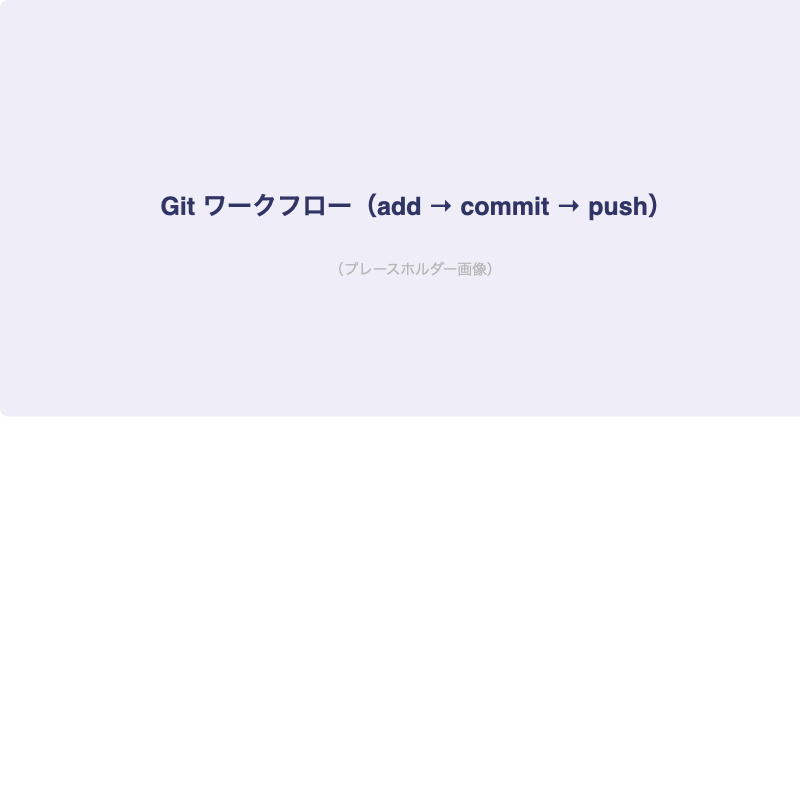
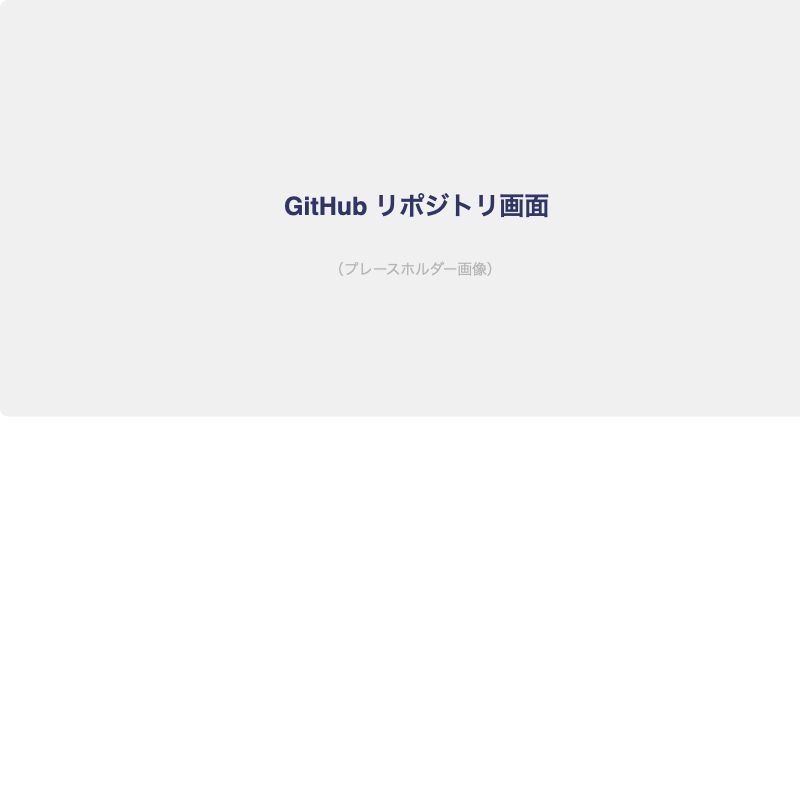

# Git/GitHubで管理しよう

## はじめに

上級編ではチーム開発に必要なスキルを学びます。
まずは[important::Git]と[important::GitHub]を使ったバージョン管理からスタートです。

:::title[このレッスンで学ぶこと]
- Gitの基本概念
- よく使うGitコマンド
- GitHubでのリモート管理
- ブランチ運用
:::

---

## Gitとは

:::gray
Git（ギット）は、ファイルの変更履歴を管理するための[marker::バージョン管理システム]です。
「いつ」「誰が」「何を変更したか」を記録して、いつでも過去の状態に戻せます。
:::

### Gitのワークフロー



### なぜGitが必要か

- コードを壊してしまっても元に戻せる
- チームで同時に開発できる
- 変更履歴が残るので、後から「なぜこう変えたか」がわかる
- [important::実務では必須のスキル]

---

## 初期設定

```bash
# ユーザー情報の設定
git config --global user.name "あなたの名前"
git config --global user.email "your-email@example.com"

# リポジトリの初期化
cd my-project
git init
```

---

## 基本的なワークフロー

```bash
# 1. 変更したファイルを確認
git status

# 2. ステージングエリアに追加
git add index.html
git add .  # すべてのファイルを追加

# 3. コミット（変更を記録）
git commit -m "feat: ヘッダーのレイアウトを実装"

# 4. ログを確認
git log --oneline
```

:::title[コミットメッセージの書き方]
フォーマット: `<Type>: <変更内容>`

| Type | 用途 | 例 |
|------|------|-----|
| `feat` | 新機能 | `feat: ログインフォームを追加` |
| `fix` | バグ修正 | `fix: スマホ表示の崩れを修正` |
| `style` | スタイル変更 | `style: フッターの余白を調整` |
| `refactor` | リファクタリング | `refactor: CSS変数に置き換え` |
| `docs` | ドキュメント | `docs: READMEを更新` |

[important::何をしたかが一目でわかるメッセージ]を書きましょう。
:::

---

## ブランチ

:::green
ブランチは「枝」という意味で、メインの開発ラインから分岐して独立した作業を行う機能です。
機能ごとにブランチを切ることで、[marker::他の人の作業に影響を与えずに開発]できます。
:::

### ブランチのイメージ


```bash
# ブランチの一覧を表示
git branch

# 新しいブランチを作成して切り替え
git checkout -b feature/header

# ブランチを切り替え
git checkout main

# ブランチをマージ
git checkout main
git merge feature/header
```

### ブランチ戦略

:::custom-table
| ブランチ名 | 役割 | 備考 |
|-----------|------|------|
| `main` | 本番リリース用 | 直接コミットしない |
| `develop` | 開発用 | 各機能ブランチをここにマージ |
| `feature/xxx` | 機能開発用 | 機能ごとに作成 |
| `fix/xxx` | バグ修正用 | バグごとに作成 |
:::

---

## .gitignore

バージョン管理に含めたくないファイルを指定します。

```txt:.gitignore
# 依存関係
node_modules/

# 環境変数
.env
.env.local

# OS固有ファイル
.DS_Store
Thumbs.db
```

:::title[.gitignoreに含めるべきファイル]
- `node_modules/` → サイズが大きく、`npm install`で再現できる
- `.env` → パスワードやAPIキーが含まれる可能性がある
- `.DS_Store` → macOS固有のファイル
- [important::秘密情報は絶対にGitに含めない]
:::

---

## GitHubの画面



---

## 今日の課題

- [x] Gitの初期設定を行う
- [x] GitHubアカウントを作成する
- [ ] ポートフォリオプロジェクトのリポジトリを作成
- [ ] ブランチを切って機能を実装し、マージする
- [ ] `.gitignore` を設定する

> Gitは最初は難しく感じますが、使っていくうちに必ず慣れます。毎日コミットする習慣をつけましょう！
