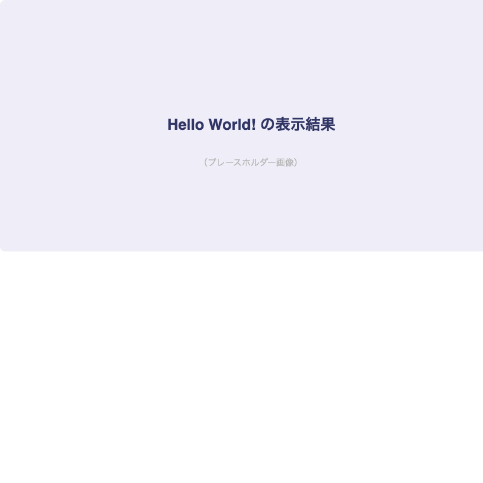
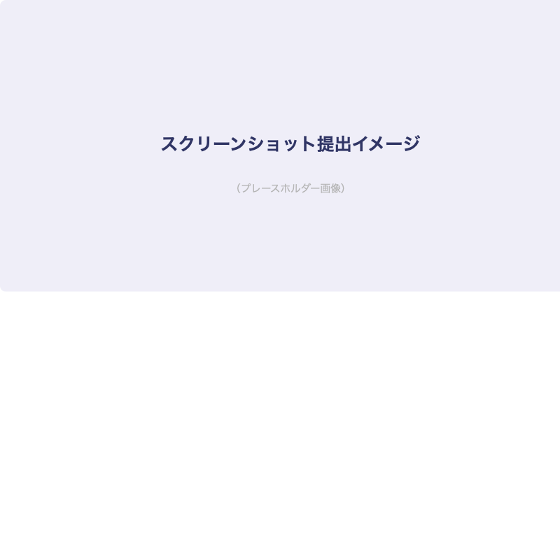

# HTMLの基礎を学ぼう

## はじめに

このレッスンでは、HTMLの基本的なタグと構造を学びます。
Webサイトを作るための[important::最初の一歩]です！

:::title[このレッスンで学ぶこと]
- HTMLファイルの基本構造
- よく使うHTMLタグ
- 見出し・段落・リストの書き方
:::

---

## HTMLファイルの基本構造

まずはHTMLファイルの雛形を作りましょう。

```html:index.html
<!DOCTYPE html>
<html lang="ja">
<head>
  <meta charset="UTF-8">
  <meta name="viewport" content="width=device-width, initial-scale=1.0">
  <title>はじめてのWebサイト</title>
</head>
<body>
  <h1>Hello World!</h1>
  <p>はじめてのWebサイトです。</p>
</body>
</html>
```

:::gray
`<!DOCTYPE html>` はHTML5であることを宣言するものです。
おまじないだと思って、必ず1行目に書きましょう。
:::

### 完成イメージ

以下のようにブラウザに表示されます。



### 各タグの役割

:::custom-table
| タグ | 役割 | 備考 |
|------|------|------|
| `<!DOCTYPE html>` | HTML5宣言 | 必ず1行目に記述 |
| `<html>` | HTML文書のルート | `lang="ja"` で日本語指定 |
| `<head>` | メタ情報 | ブラウザには表示されない |
| `<meta charset>` | 文字コード指定 | `UTF-8` を指定 |
| `<meta name="viewport">` | レスポンシブ対応 | スマホ表示に必須 |
| `<title>` | ページタイトル | ブラウザのタブに表示される |
| `<body>` | ページの中身 | ここに書いた内容が表示される |
:::

---

## よく使うHTMLタグ

### 見出しタグ

見出しは `h1` ～ `h6` の6段階あります。

```html
<h1>大見出し（h1）</h1>
<h2>中見出し（h2）</h2>
<h3>小見出し（h3）</h3>
```

:::green
[important::h1タグはページに1つだけ]にしましょう。
SEO（検索エンジン最適化）の観点からも重要なルールです。
:::

### 段落タグ

```html
<p>これは段落です。</p>
<p>別の段落です。文章のまとまりごとに p タグで囲みます。</p>
```

### リストタグ

リストには[marker::順序なしリスト]と[marker::順序ありリスト]の2種類があります。

**順序なしリスト（箇条書き）**

```html
<ul>
  <li>HTML</li>
  <li>CSS</li>
  <li>JavaScript</li>
</ul>
```

**順序ありリスト（番号付き）**

```html
<ol>
  <li>まずHTMLを書く</li>
  <li>次にCSSで装飾する</li>
  <li>最後にJavaScriptで動きをつける</li>
</ol>
```

---

## 画像の表示

```html

```

:::title[altタグについて]
`alt` 属性は画像の代替テキストです。

- 画像が表示できないときにテキストが表示される
- スクリーンリーダー（読み上げソフト）で読まれる
- [important::SEOにも影響する]ので必ず設定しましょう
:::

---

## リンクの作成

```html
<!-- 別のページへのリンク -->
<a href="about.html">自己紹介ページへ</a>

<!-- 外部サイトへのリンク（別タブで開く） -->
<a href="https://example.com" target="_blank" rel="noopener noreferrer">
  外部サイトへ
</a>
```

:::gray
`target="_blank"` を使う場合は、セキュリティ対策として `rel="noopener noreferrer"` を必ずつけましょう。
:::

---

## 今日の課題

- [x] HTMLファイルを新規作成する
- [x] 基本構造（DOCTYPE, html, head, body）を書く
- [ ] 見出し・段落・リストを使ってプロフィールページを作る
- [ ] 画像とリンクを追加する

:::title[提出方法]
作成した `index.html` をブラウザで開いて、スクリーンショットを提出してください。


:::
