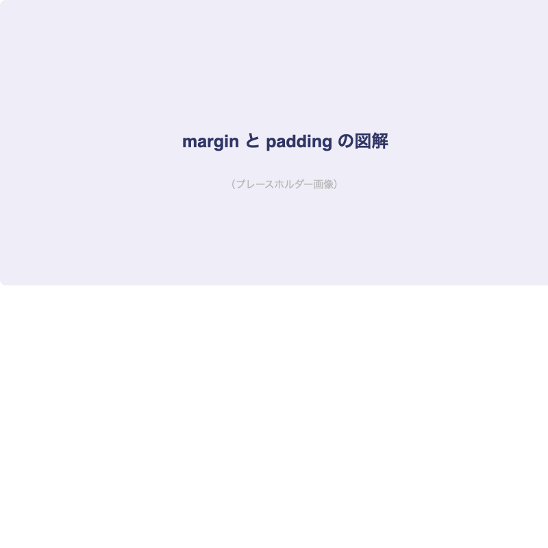
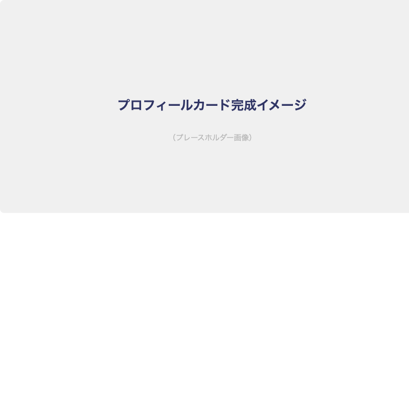
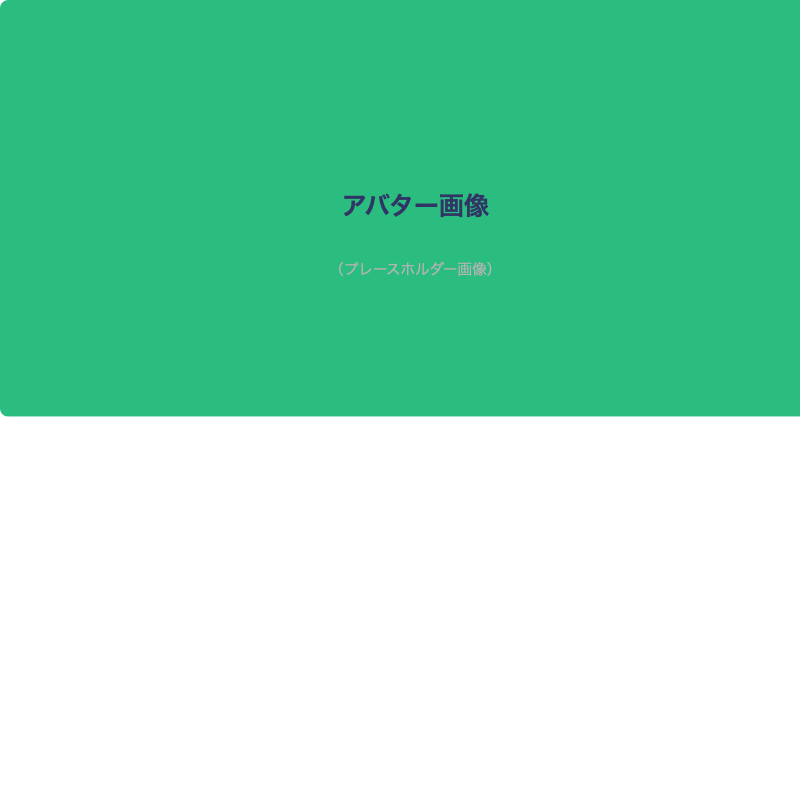

# CSSの基礎を学ぼう

## はじめに

前回HTMLの基本を学びました。今回は[important::CSSでWebサイトを装飾する方法]を学びます。

:::title[このレッスンで学ぶこと]
- CSSの書き方（3つの方法）
- セレクタの基本
- よく使うプロパティ
- 色・フォント・余白の指定方法
:::

---

## CSSの3つの書き方

### 1. 外部ファイル（推奨）

```html:index.html
<head>
  <link rel="stylesheet" href="style.css">
</head>
```

```css:style.css
h1 {
  color: #333;
  font-size: 24px;
}
```

### 2. headタグ内に記述

```html
<head>
  <style>
    h1 {
      color: #333;
    }
  </style>
</head>
```

### 3. インラインスタイル

```html
<h1 style="color: #333;">見出し</h1>
```

:::green
実務では[important::外部ファイル方式が基本]です。
HTMLとCSSを分離することで、管理しやすくなります。
:::

---

## セレクタの基本

### タグセレクタ

```css
/* すべての p タグに適用 */
p {
  font-size: 16px;
  line-height: 1.8;
}
```

### クラスセレクタ

```css
/* class="highlight" の要素に適用 */
.highlight {
  background-color: #ff0;
  padding: 4px 8px;
}
```

```html
<p class="highlight">ハイライトされたテキスト</p>
```

### IDセレクタ

```css
/* id="header" の要素に適用 */
#header {
  background-color: #303565;
  color: white;
}
```

:::gray
IDセレクタはページ内で一度だけ使えます。
繰り返し使うスタイルには[marker::クラスセレクタ]を使いましょう。
:::

### セレクタの優先順位

:::custom-table
| 優先度 | セレクタ | 例 | 詳細度 |
|--------|---------|-----|--------|
| 高 | インラインスタイル | `style="..."` | 1000 |
| ↑ | IDセレクタ | `#header` | 100 |
| ↑ | クラスセレクタ | `.highlight` | 10 |
| 低 | タグセレクタ | `p` | 1 |
:::

---

## よく使うプロパティ

### 色の指定

```css
.text-example {
  /* カラーネーム */
  color: red;

  /* HEX（16進数） */
  color: #EC6D64;

  /* RGB */
  color: rgb(236, 109, 100);

  /* RGBA（透明度あり） */
  color: rgba(236, 109, 100, 0.8);
}
```

### フォントサイズ

```css
body {
  font-size: 16px;        /* ピクセル指定 */
  font-family: 'Noto Sans JP', sans-serif;
}

h1 {
  font-size: 1.5rem;      /* ルートを基準にした相対指定 */
  font-weight: bold;       /* 太字 */
}

.small {
  font-size: 0.875em;     /* 親要素を基準にした相対指定 */
}
```

:::title[px, em, rem の違い]
- `px`: 絶対値。常に同じ大きさ
- `em`: 親要素のフォントサイズを基準とした相対値
- `rem`: ルート要素（html）のフォントサイズを基準とした相対値

実務では[important::remを使うのが主流]です。
:::

### 余白（margin と padding）



```css
.box {
  /* padding: 要素の内側の余白 */
  padding: 16px;
  padding: 10px 20px;           /* 上下 左右 */
  padding: 10px 20px 30px 40px; /* 上 右 下 左（時計回り） */

  /* margin: 要素の外側の余白 */
  margin: 24px auto; /* 上下24px、左右は中央揃え */
  margin-bottom: 16px;
}
```

:::green
`margin: 0 auto;` は[marker::ブロック要素を中央揃え]にする定番テクニックです。
（`width` の指定が必要）
:::

---

## 実践：プロフィールカードを作ろう

### 完成イメージ



```html:index.html
<div class="card">
  
  <h2 class="card__name">山田太郎</h2>
  <p class="card__role">Webデザイナー</p>
  <p class="card__bio">東京都在住のWebデザイナーです。HTML/CSSが得意です。</p>
</div>
```

```css:style.css
.card {
  max-width: 400px;
  margin: 40px auto;
  padding: 32px;
  border-radius: 8px;
  box-shadow: 0 2px 14px rgba(0, 0, 0, 0.15);
  text-align: center;
}

.card__avatar {
  width: 120px;
  height: 120px;
  border-radius: 50%;
  object-fit: cover;
  margin-bottom: 16px;
}

.card__name {
  font-size: 24px;
  font-weight: bold;
  color: #303565;
  margin-bottom: 4px;
}

.card__role {
  font-size: 14px;
  color: #B5B5B5;
  margin-bottom: 16px;
}

.card__bio {
  font-size: 16px;
  line-height: 1.8;
  color: #333;
}
```

---

## 今日の課題

- [ ] 外部CSSファイルを作成してHTMLに読み込む
- [ ] 前回作ったプロフィールページにCSSを適用する
- [ ] 色・フォント・余白を調整して見た目を整える
- [ ] プロフィールカードのデザインを再現する

> CSSは書いた分だけ上達します。まずは真似することから始めましょう！
