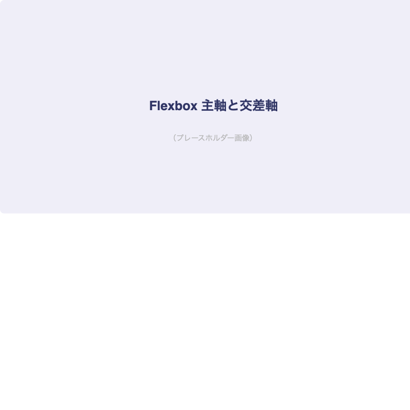
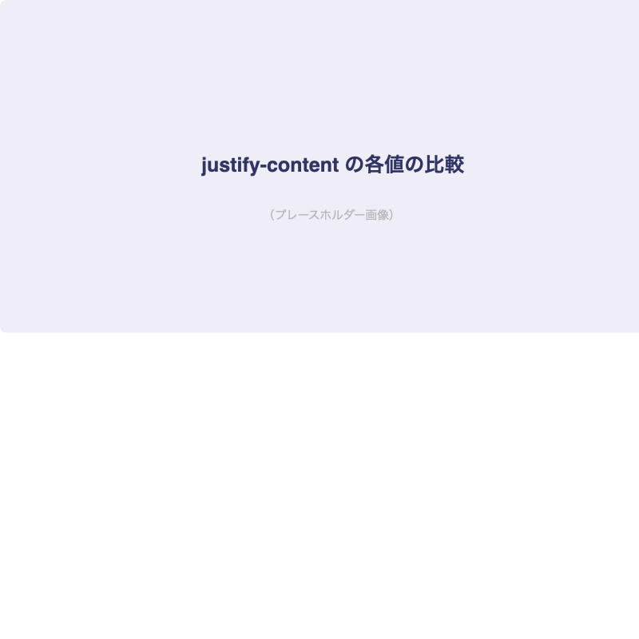
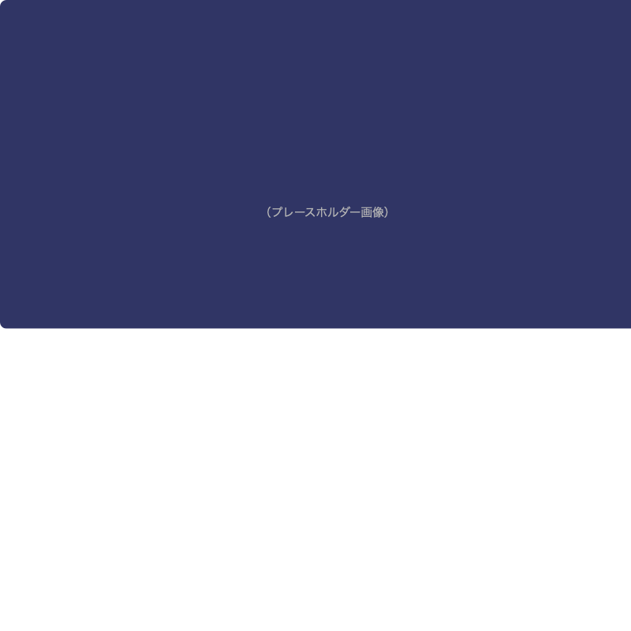

# CSSレイアウトの基礎（Flexbox）

## はじめに

今回はWebサイトのレイアウトに欠かせない[important::Flexbox]を学びます。
Flexboxを使えば、要素の横並びや中央揃えが簡単にできるようになります。

:::title[このレッスンで学ぶこと]
- display: flex の基本
- 主軸と交差軸の概念
- よく使うFlexboxプロパティ
- 実践：ナビゲーションバーの作成
:::

---

## Flexboxとは

:::gray
Flexbox（Flexible Box Layout）は、要素を柔軟に配置するためのCSSレイアウトモデルです。
従来の `float` を使ったレイアウトよりも[marker::直感的で簡単]です。
:::

### 基本の使い方

```css
.container {
  display: flex;
}
```

これだけで子要素が[important::横並び]になります。

### Flexboxの図解



```html:index.html
<div class="container">
  <div class="item">1</div>
  <div class="item">2</div>
  <div class="item">3</div>
</div>
```

```css:style.css
.container {
  display: flex;
  gap: 16px;
}

.item {
  padding: 24px;
  background-color: #EFEEF8;
  border-radius: 8px;
  text-align: center;
}
```

---

## 主軸と交差軸

Flexboxには[marker::主軸（main axis）]と[marker::交差軸（cross axis）]があります。

:::custom-table
| プロパティ | 方向 | 初期値 | 説明 |
|-----------|------|--------|------|
| `flex-direction` | 主軸の方向 | `row`（横） | `column` にすると縦方向 |
| `justify-content` | 主軸の配置 | `flex-start` | 横方向の揃え方 |
| `align-items` | 交差軸の配置 | `stretch` | 縦方向の揃え方 |
:::

### justify-content の各値



```css
.container {
  display: flex;
  justify-content: center;       /* 中央揃え */
  justify-content: space-between; /* 両端揃え */
  justify-content: space-around;  /* 均等配置 */
  justify-content: flex-end;      /* 右揃え */
}
```

### align-items の各値

```css
.container {
  display: flex;
  align-items: center;    /* 上下中央揃え */
  align-items: flex-start; /* 上揃え */
  align-items: flex-end;   /* 下揃え */
}
```

:::title[上下左右中央揃えの定番パターン]
```css
.center {
  display: flex;
  justify-content: center;
  align-items: center;
}
```

この3行は[important::超頻出パターン]なので覚えておきましょう！
:::

---

## 実践：ナビゲーションバー

### 完成イメージ



```html:index.html
<header class="header">
  <h1 class="header__logo">MySite</h1>
  <nav class="header__nav">
    <a href="#" class="header__link">ホーム</a>
    <a href="#" class="header__link">サービス</a>
    <a href="#" class="header__link">料金</a>
    <a href="#" class="header__link">お問い合わせ</a>
  </nav>
</header>
```

```css:style.css
.header {
  display: flex;
  justify-content: space-between;
  align-items: center;
  padding: 16px 32px;
  background-color: #303565;
}

.header__logo {
  color: white;
  font-size: 24px;
  margin: 0;
}

.header__nav {
  display: flex;
  gap: 24px;
}

.header__link {
  color: white;
  text-decoration: none;
  font-size: 14px;
  transition: opacity 0.3s;
}

.header__link:hover {
  opacity: 0.7;
}
```

---

## Flexboxチートシート

:::custom-table
| プロパティ | 値 | 効果 |
|-----------|-----|------|
| `display` | `flex` | Flexコンテナにする |
| `flex-direction` | `row` / `column` | 主軸の方向 |
| `justify-content` | `center` / `space-between` / `flex-end` | 主軸の配置 |
| `align-items` | `center` / `flex-start` / `flex-end` | 交差軸の配置 |
| `flex-wrap` | `wrap` / `nowrap` | 折り返し |
| `gap` | `16px` | 子要素間の余白 |
| `flex` | `1` | 子要素を均等に伸縮 |
| `order` | `0` / `1` / `-1` | 表示順の変更 |
:::

---

## 今日の課題

- [ ] Flexboxで3列のカードレイアウトを作成
- [ ] ナビゲーションバーを実装
- [ ] フッターにFlexboxを使ったリンク一覧を配置
- [ ] すべてのレイアウトがブラウザの幅を変えても崩れないか確認
