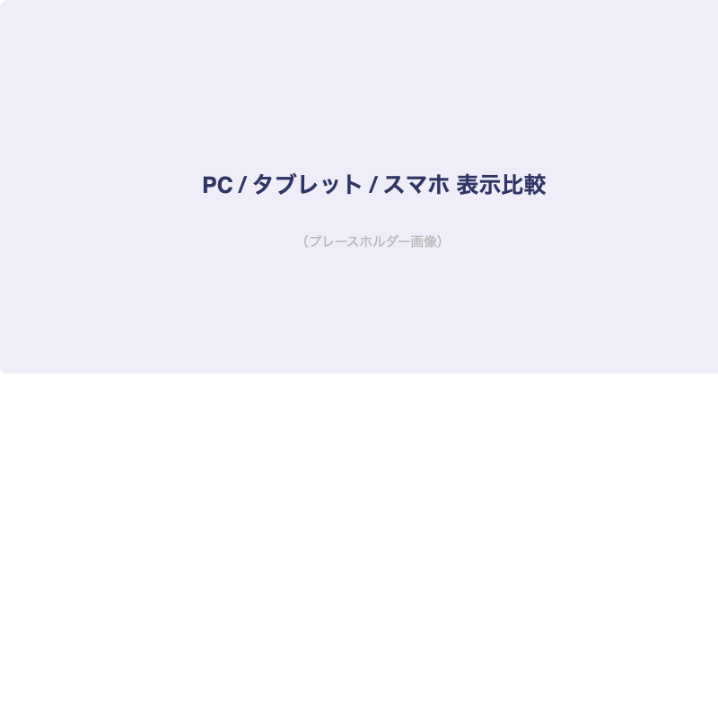
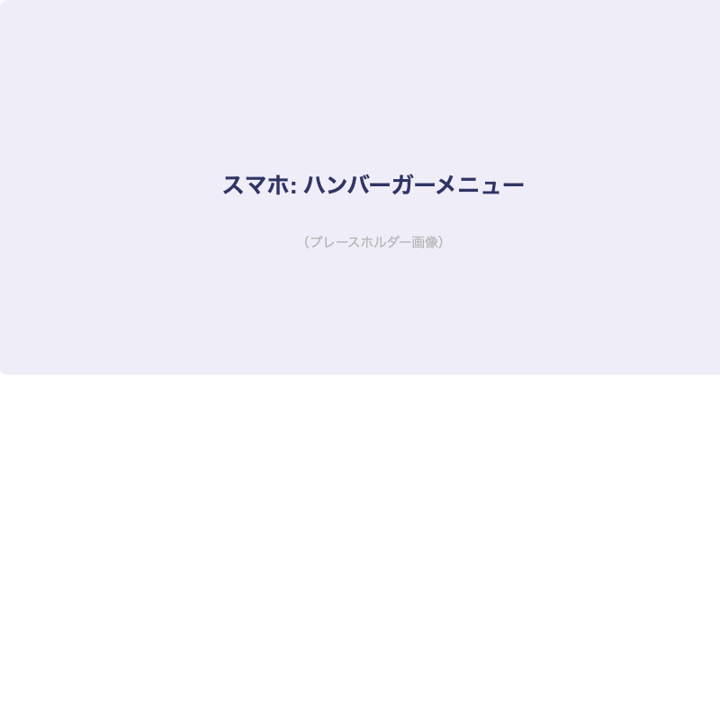
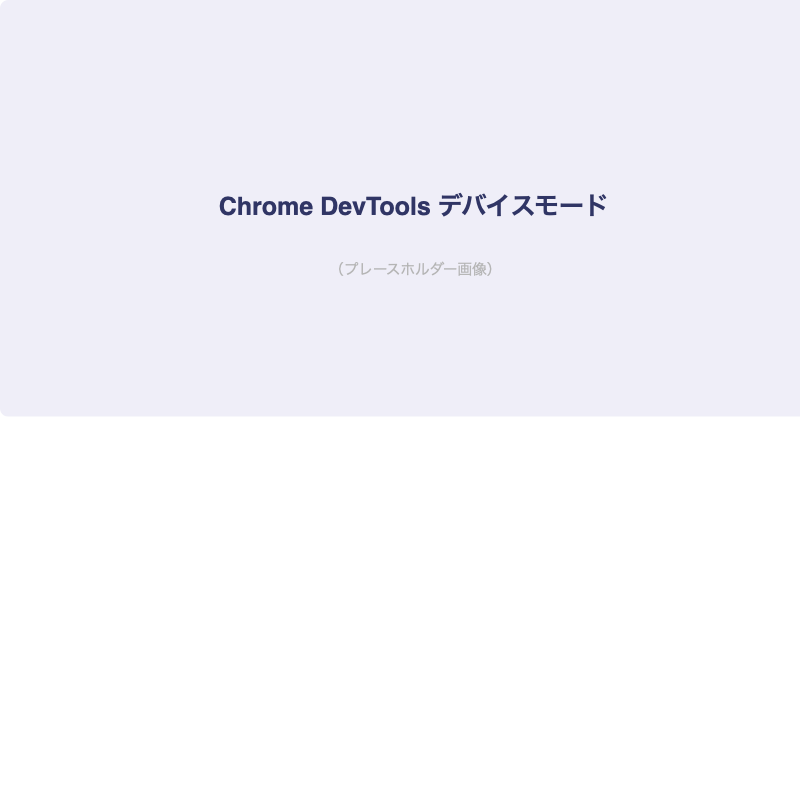

# レスポンシブデザイン入門

## はじめに

Webサイトは様々なデバイスで閲覧されます。PC・タブレット・スマホすべてで快適に見られるようにする技術が[important::レスポンシブデザイン]です。

:::title[このレッスンで学ぶこと]
- メディアクエリの書き方
- ブレイクポイントの考え方
- モバイルファーストとは
- 実践：レスポンシブなレイアウト
:::

---

## メディアクエリ

```css
/* 画面幅が768px以上のとき */
@media (min-width: 768px) {
  .container {
    max-width: 720px;
  }
}

/* 画面幅が1024px以上のとき */
@media (min-width: 1024px) {
  .container {
    max-width: 960px;
  }
}
```

:::gray
`@media` はCSSの機能で、画面サイズに応じてスタイルを切り替えることができます。
これを[marker::メディアクエリ]と呼びます。
:::

### よく使うブレイクポイント

:::custom-table
| デバイス | 幅 | 備考 |
|---------|-----|------|
| スマホ | 〜767px | 基準（モバイルファースト） |
| タブレット | 768px〜 | iPadの横幅が768px |
| PC | 1024px〜 | 一般的なPCモニター |
| 大画面PC | 1280px〜 | 必要に応じて |
:::

---

## モバイルファースト

:::title[モバイルファーストとは]
スマホ用のスタイルをベースとして書き、画面が大きくなるにつれてスタイルを追加していく考え方です。

[important::現代のWeb制作ではモバイルファーストが標準]です。
:::

### レスポンシブ対応の比較



```css
/* ベース：スマホ向け */
.grid {
  display: flex;
  flex-direction: column;
  gap: 16px;
}

/* タブレット以上：2列 */
@media (min-width: 768px) {
  .grid {
    flex-direction: row;
    flex-wrap: wrap;
  }
  .grid__item {
    width: calc(50% - 8px);
  }
}

/* PC以上：3列 */
@media (min-width: 1024px) {
  .grid__item {
    width: calc(33.333% - 11px);
  }
}
```

---

## 実践：レスポンシブなヘッダー

スマホではハンバーガーメニュー、PCでは横並びナビになるヘッダーを作ります。

### スマホ表示



### PC表示


```html:index.html
<header class="header">
  <h1 class="header__logo">MyPortfolio</h1>
  <button class="header__burger" id="menuBtn">☰</button>
  <nav class="header__nav" id="menu">
    <a href="#" class="header__link">ホーム</a>
    <a href="#" class="header__link">作品集</a>
    <a href="#" class="header__link">スキル</a>
    <a href="#" class="header__link">お問い合わせ</a>
  </nav>
</header>
```

```css:style.css
.header {
  display: flex;
  justify-content: space-between;
  align-items: center;
  flex-wrap: wrap;
  padding: 16px;
  background-color: #303565;
}

.header__logo {
  color: white;
  font-size: 20px;
  margin: 0;
}

.header__burger {
  display: block;
  background: none;
  border: none;
  color: white;
  font-size: 24px;
  cursor: pointer;
}

.header__nav {
  display: none;
  width: 100%;
  flex-direction: column;
  gap: 8px;
  padding-top: 16px;
}

.header__nav.is-open {
  display: flex;
}

/* PC表示 */
@media (min-width: 768px) {
  .header__burger {
    display: none;
  }

  .header__nav {
    display: flex;
    width: auto;
    flex-direction: row;
    gap: 24px;
    padding-top: 0;
  }
}
```

```javascript:script.js
const menuBtn = document.getElementById('menuBtn')
const menu = document.getElementById('menu')

menuBtn.addEventListener('click', () => {
  menu.classList.toggle('is-open')
})
```

---

## Chrome DevToolsで確認しよう



:::green
Chrome DevToolsの「デバイスモード」（`Ctrl + Shift + M` / `Cmd + Shift + M`）を使うと、各デバイスサイズでの表示を簡単に確認できます。
:::

---

## 今日の課題

- [ ] 前回作ったサイトにメディアクエリを追加する
- [ ] スマホ・タブレット・PCで表示を切り替える
- [ ] ハンバーガーメニューを実装する
- [ ] Chrome DevToolsのデバイスモードで各画面サイズを確認する
