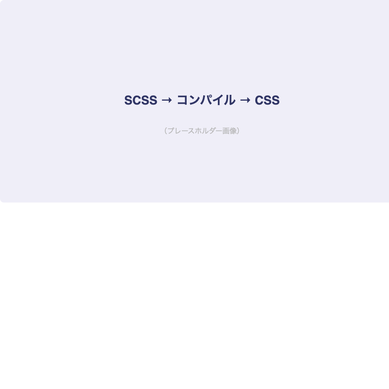
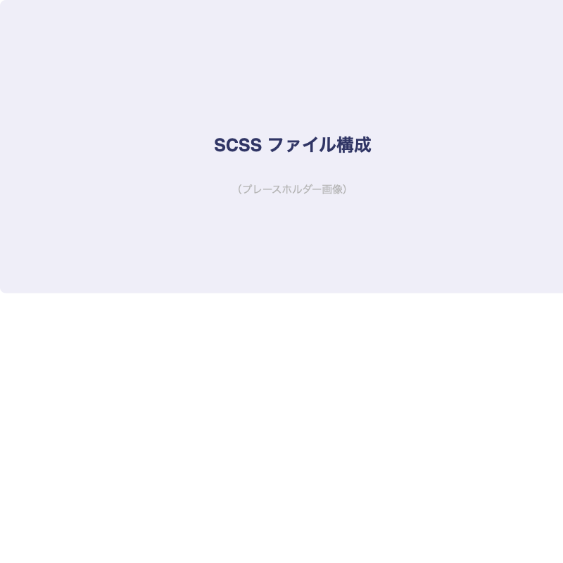

# Sassを導入しよう

## はじめに

中級編では、実務レベルのCSS設計とツールを学びます。
最初のテーマは[important::Sass（SCSS記法）]です。

:::title[このレッスンで学ぶこと]
- Sassとは何か
- SCSS記法の基本
- 変数・ネスト・ミックスイン
- ファイル分割（パーシャル）
:::

---

## Sassとは

:::gray
Sass（Syntactically Awesome Stylesheets）は、CSSを効率よく書くための拡張言語です。
ブラウザは直接Sassを読めないので、[marker::CSSにコンパイル]して使います。
:::

### Sassの仕組み



### SCSS記法 vs Sass記法

:::custom-table
| 記法 | 拡張子 | 特徴 |
|------|--------|------|
| SCSS | `.scss` | CSSと互換性あり。中括弧とセミコロンを使う |
| Sass | `.sass` | インデントベース。中括弧とセミコロン不要 |
:::

[important::実務ではSCSS記法が主流]です。このレッスンでもSCSS記法を使います。

---

## 変数

よく使う値を変数にまとめておけます。

```css:_variables.scss
$color-primary: #303565;
$color-success: #2BBC7F;
$color-text: #333;
$color-gray: #B5B5B5;

$font-size-sm: 14px;
$font-size-base: 16px;
$font-size-lg: 18px;
$font-size-xl: 24px;

$breakpoint-tablet: 768px;
$breakpoint-pc: 1024px;
```

```css:style.scss
@import 'variables';

.header {
  background-color: $color-primary;
  color: white;
  font-size: $font-size-base;
}
```

---

## ネスト

```css:style.scss
// Sass（ネスト）
.header {
  display: flex;
  align-items: center;

  &__logo {
    font-size: $font-size-xl;
    font-weight: bold;
  }

  &__nav {
    display: flex;
    gap: 24px;
  }

  &__link {
    color: white;
    text-decoration: none;

    &:hover {
      opacity: 0.7;
    }
  }
}
```

:::green
`&` は親セレクタを参照します。BEM記法との相性が抜群です。
ただし[important::ネストは3階層まで]にしましょう。深すぎるネストは可読性が下がります。
:::

---

## ミックスイン

繰り返し使うスタイルのパターンをまとめられます。

```css:_mixins.scss
@mixin responsive($breakpoint) {
  @media (min-width: $breakpoint) {
    @content;
  }
}

@mixin flex-center {
  display: flex;
  justify-content: center;
  align-items: center;
}
```

```css:style.scss
@import 'variables';
@import 'mixins';

.hero {
  @include flex-center;
  height: 100vh;
  background-color: $color-primary;
}

.grid {
  display: flex;
  flex-direction: column;

  @include responsive($breakpoint-tablet) {
    flex-direction: row;
    flex-wrap: wrap;
  }
}
```

---

## ファイル分割

### ディレクトリ構成



```bash
scss/
├── style.scss          # メインファイル
├── _variables.scss     # 変数
├── _mixins.scss        # ミックスイン
├── _reset.scss         # リセットCSS
├── _header.scss        # ヘッダー
├── _footer.scss        # フッター
└── _card.scss          # カード
```

:::title[ファイル分割のルール]
- `_`（アンダースコア）始まりのファイルは「パーシャル」
- パーシャルは単体ではコンパイルされない
- メインファイルで `@import` して使う
- [important::コンポーネントごとにファイルを分ける]のが基本
:::

---

## 今日の課題

- [ ] Sassをインストールしてコンパイル環境を構築
- [ ] 前回のCSSをSCSS記法に書き換える
- [ ] 変数・ネスト・ミックスインを活用する
- [ ] コンポーネントごとにファイルを分割する
