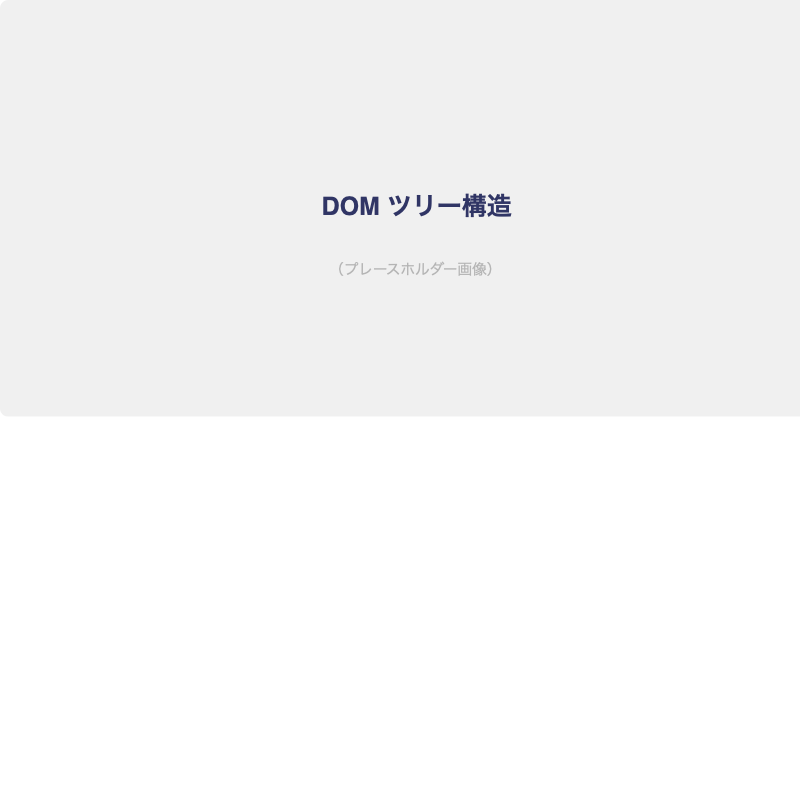
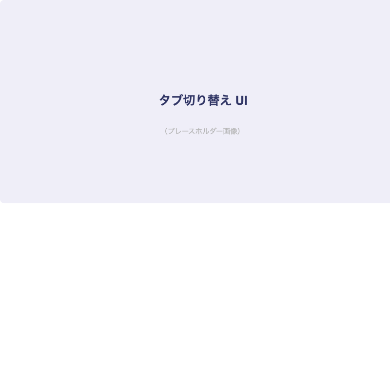

# JavaScript DOM操作

## はじめに

JavaScriptでWebページを動的に操作するための[important::DOM（Document Object Model）]を学びます。

:::title[このレッスンで学ぶこと]
- DOMとは何か
- 要素の取得・作成・削除
- イベントリスナー
- 実践：タブ切り替え・モーダル
:::

---

## DOMとは

:::gray
DOM（Document Object Model）は、HTMLをJavaScriptから操作するための仕組みです。
HTMLの各タグが「ノード」というオブジェクトになり、ツリー構造で管理されます。
:::

### DOMツリーのイメージ



---

## 要素の取得

```javascript
// IDで取得（1つ）
const header = document.getElementById('header')

// クラスで取得（複数）
const items = document.querySelectorAll('.item')

// CSSセレクタで取得（最初の1つ）
const firstItem = document.querySelector('.item')

// CSSセレクタで取得（すべて）
const allLinks = document.querySelectorAll('a[href^="https"]')
```

:::title[querySelector vs getElementById]
- `getElementById` → IDでのみ取得。高速
- `querySelector` → CSSセレクタで取得。柔軟
- `querySelectorAll` → CSSセレクタに一致する全要素を取得

実務では[important::querySelector / querySelectorAllが主流]です。
:::

---

## 要素の操作

### テキスト・HTMLの変更

```javascript
const title = document.querySelector('.title')

// テキストを変更
title.textContent = '新しいタイトル'

// HTMLを変更（注意: XSS対策が必要）
title.innerHTML = '<span class="highlight">新しいタイトル</span>'
```

### クラスの操作

```javascript
const element = document.querySelector('.box')

element.classList.add('is-active')      // クラスを追加
element.classList.remove('is-active')   // クラスを削除
element.classList.toggle('is-active')   // 切り替え
element.classList.contains('is-active') // 存在確認 → true/false
```

:::green
スタイルの直接変更よりも[marker::クラスの付け外し]の方が保守性が高いです。
スタイルはCSSに、動的な制御はJavaScriptに分離しましょう。
:::

---

## イベントリスナー

```javascript
const button = document.querySelector('.button')

// クリックイベント
button.addEventListener('click', () => {
  console.log('クリックされました')
})
```

### よく使うイベント一覧

:::custom-table
| イベント | 発生タイミング | 用途 |
|---------|--------------|------|
| `click` | クリック時 | ボタン操作 |
| `submit` | フォーム送信時 | バリデーション |
| `input` | 入力変更時 | リアルタイムバリデーション |
| `scroll` | スクロール時 | ヘッダー固定、パララックス |
| `load` | ページ読み込み完了時 | 初期化処理 |
| `DOMContentLoaded` | DOM構築完了時 | 早期の初期化 |
| `resize` | ウィンドウサイズ変更時 | レスポンシブ対応 |
| `keydown` / `keyup` | キー操作時 | ショートカットキー |
:::

---

## 実践：タブ切り替え

### 完成イメージ



```html:index.html
<div class="tabs">
  <div class="tabs__buttons">
    <button class="tabs__btn is-active" data-target="tab1">HTML</button>
    <button class="tabs__btn" data-target="tab2">CSS</button>
    <button class="tabs__btn" data-target="tab3">JavaScript</button>
  </div>
  <div class="tabs__content">
    <div class="tabs__panel is-active" id="tab1">
      <p>HTMLはWebページの構造を定義する言語です。</p>
    </div>
    <div class="tabs__panel" id="tab2">
      <p>CSSはWebページの見た目を装飾する言語です。</p>
    </div>
    <div class="tabs__panel" id="tab3">
      <p>JavaScriptはWebページに動きをつけるプログラミング言語です。</p>
    </div>
  </div>
</div>
```

```javascript:script.js
const tabButtons = document.querySelectorAll('.tabs__btn')
const tabPanels = document.querySelectorAll('.tabs__panel')

tabButtons.forEach(button => {
  button.addEventListener('click', () => {
    const target = button.dataset.target

    // すべてのボタンとパネルから is-active を外す
    tabButtons.forEach(btn => btn.classList.remove('is-active'))
    tabPanels.forEach(panel => panel.classList.remove('is-active'))

    // クリックされたボタンと対応するパネルに is-active を付ける
    button.classList.add('is-active')
    document.getElementById(target).classList.add('is-active')
  })
})
```

```css:style.css
.tabs__panel {
  display: none;
}

.tabs__panel.is-active {
  display: block;
}

.tabs__btn {
  padding: 8px 24px;
  border: none;
  background-color: #F0F0F0;
  cursor: pointer;
  font-size: 14px;
}

.tabs__btn.is-active {
  background-color: #303565;
  color: white;
}
```

---

## 今日の課題

- [ ] タブ切り替えUIを実装する
- [ ] モーダルウィンドウ（表示/非表示の切り替え）を実装する
- [ ] スクロール位置に応じてヘッダーの背景色を変える
- [ ] フォームのバリデーション（未入力チェック）を実装する

:::title[DOM操作の注意点]
- `innerHTML` にユーザー入力をそのまま入れない（XSS対策）
- `querySelectorAll` の戻り値はNodeListで、配列ではない
- イベントリスナーの登録し忘れ・重複登録に注意
:::
